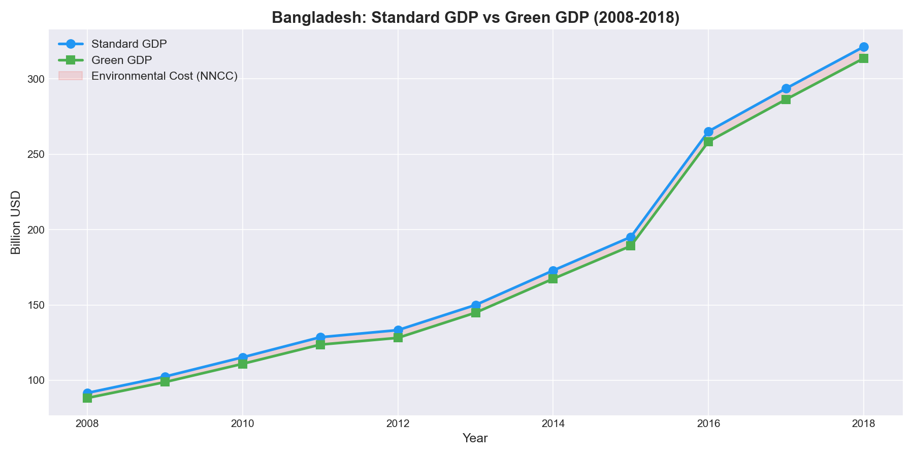
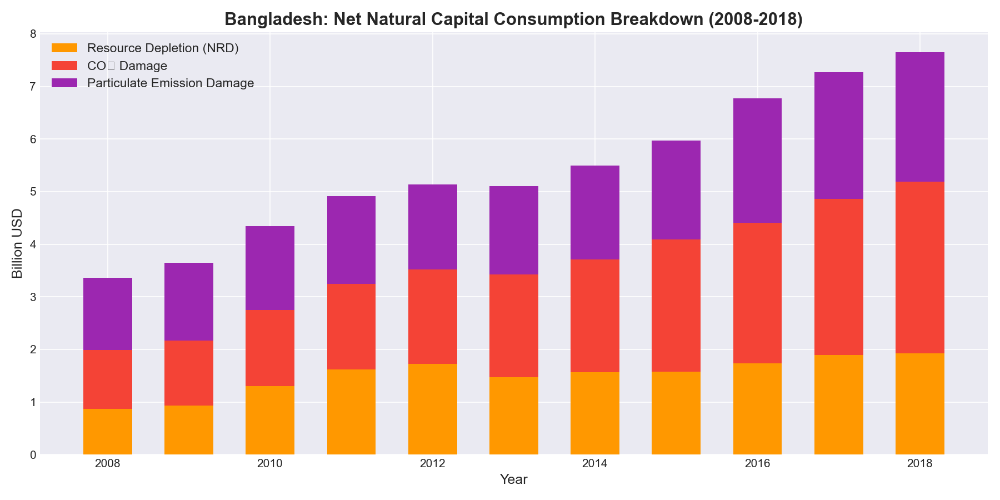
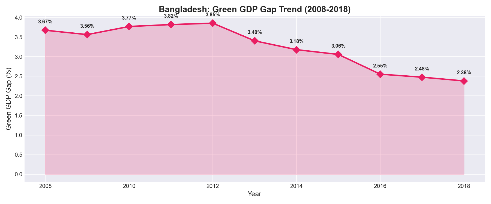
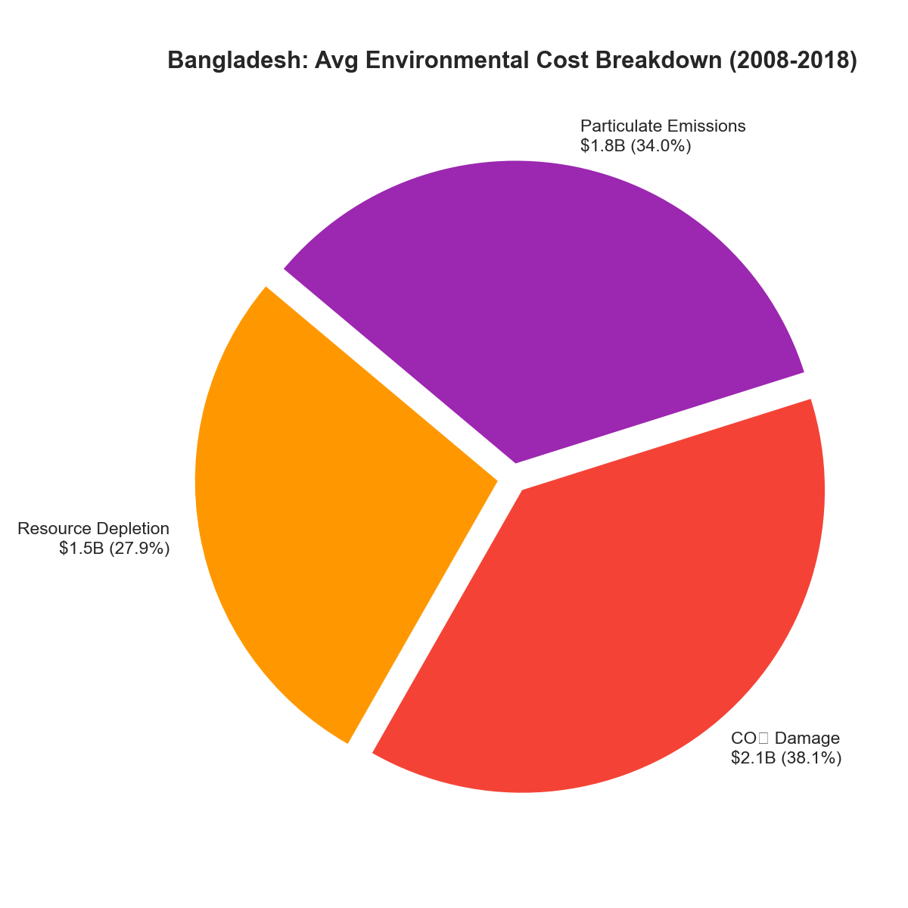
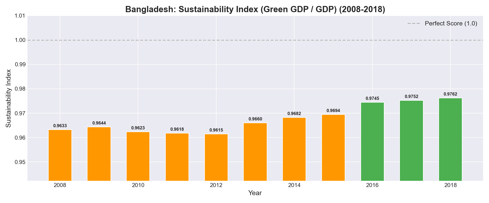
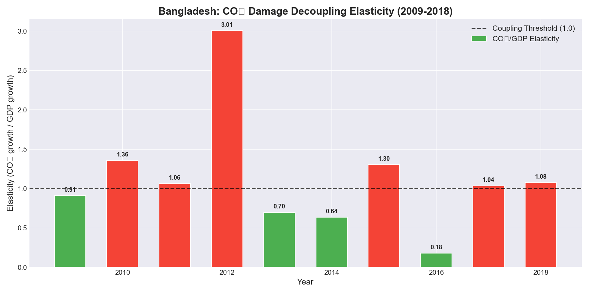
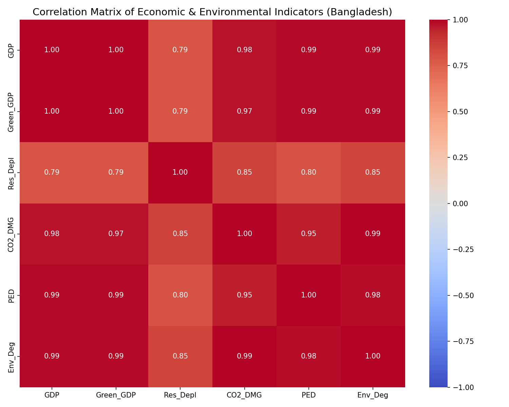
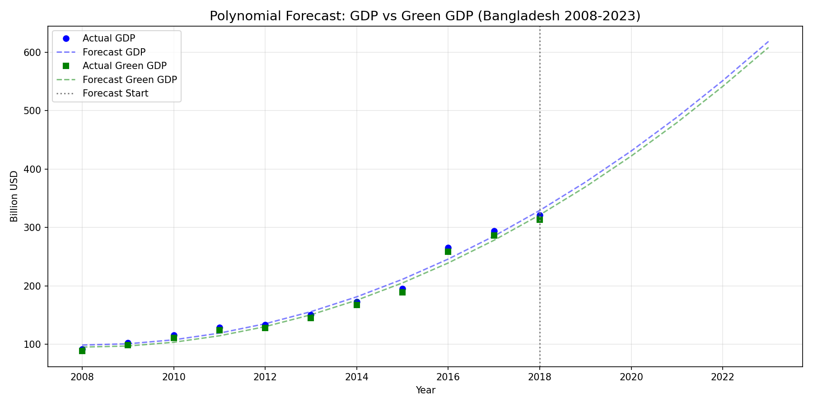
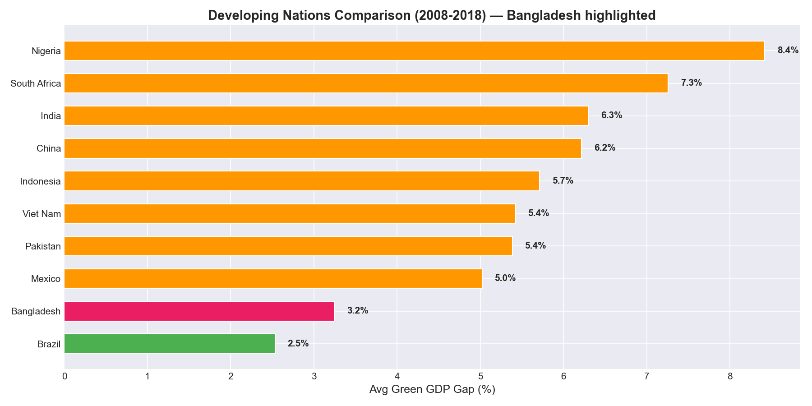

# Case Study: True Economic Progress of Bangladesh (2008–2018)
### *Green GDP & Sustainable Development Analysis*

[-red.svg)](bangladesh.md)

---

## 📌 Executive Summary

This case study evaluates whether Bangladesh's rapid economic growth between 2008 and 2018 represents genuine improvements in national wellbeing or masks significant natural capital depletion and environmental degradation. By computing **Green GDP** — standard GDP minus the monetary value of natural resource depletion and pollution costs — we reveal the true cost of growth.

### Core Key Findings (2008–2018):

| Metric | Empirical Value | Economic Interpretation |
| :--- | :---: | :--- |
| **Standard GDP CAGR** | **13.37%** | Nominal expansion from $\$91.64\text{B}$ to $\$321.36\text{B}$ ($3.51\times$). |
| **Green GDP CAGR** | **13.52%** | Environmentally adjusted growth from $\$88.27\text{B}$ to $\$313.71\text{B}$ ($3.55\times$). |
| **Average Green GDP Gap** | **3.25%** | Percentage of annual economic output absorbed by natural capital costs. |
| **Average Sustainability Index** | **0.9675** | Ratio of Green GDP to Standard GDP ($1.00 = \text{perfect sustainability}$). |
| **10-Year Cumulative NNCC** | **$\$59.68 \text{ Billion}$** | Total monetary cost of resource depletion and environmental damage. |
| **$\text{CO}_2$ Decoupling Elasticity ($\varepsilon$)** | **1.127** | **No Decoupling (Recoupled)**: Emissions damage grew faster than GDP. |
| **Overall NNCC Elasticity ($\varepsilon$)** | **0.735** | **Relative Decoupling**: Aggregate environmental costs grew slower than GDP. |

**Verdict:** Bangladesh's economic growth is genuine and expanding national welfare. The Green GDP Gap declined from $3.67\%$ in 2008 to $2.38\%$ in 2018, indicating that environmental costs consume a shrinking share of national output. However, $\text{CO}_2$ damage remains tightly coupled to economic expansion ($\varepsilon > 1$), posing long-term climate vulnerabilities.

---

## 🇧🇩 Country Profile: Why Bangladesh?

1. **Rapid Structural Transformation**:
   Between 2008 and 2018, Bangladesh transitioned from a Low-Income Country (LIC) to a Lower-Middle-Income Country (LMIC) (World Bank, 2015). By 2018, its sector composition stood at:
   * **Services**: $\sim 53\%$ of GDP
   * **Industry**: $\sim 30\%$ of GDP (dominated by Ready-Made Garments - RMG, generating $\$30.6\text{B}$ in export revenue)
   * **Agriculture**: $\sim 13\%$ of GDP

2. **The Climate Vulnerability Paradox**:
   Bangladesh contributes less than $0.35\%$ of global greenhouse emissions but ranks among the top 10 most climate-vulnerable nations worldwide. Over $80\%$ of its landmass is floodplain, and projections suggest $17\%$ of territory could be lost to sea-level rise by 2050.

3. **Natural Resource Depletion Profile**:
   Bangladesh's primary non-renewable asset is natural gas, historically powering $\sim 62\%$ of domestic power generation. Domestic gas reserves face severe depletion, forcing an increasing reliance on expensive imported LNG.

---

## 🧮 Empirical Methodology & Formulations

$$\text{Green GDP} = \text{Standard GDP} - \text{Net Natural Capital Consumption (NNCC)}$$

$$\text{NNCC} = \text{Resource Depletion (USD)} + \text{CO}_2 \text{ Damage (USD)} + \text{Particulate Emission Damage (PED USD)}$$

### World Bank Indicators Applied:
* **GDP (current US$)**: `NY.GDP.MKTP.CD`
* **GNI (current US$)**: `NY.GNP.MKTP.CD`
* **Natural Resource Depletion (% of GNI)**: `NY.ADJ.DRES.GN.ZS`
* **$\text{CO}_2$ Damage (current US$)**: `NY.ADJ.DCO2.CD`
* **Particulate Emission Damage (current US$)**: `NY.ADJ.DPEM.CD`

---

## 📊 Year-by-Year Dataset Analysis (2008–2018)

| Year | Standard GDP | Green GDP | Resource Depletion | $\text{CO}_2$ Damage | Particulate Damage | Total NNCC | Gap % | Sustainability Index |
| :---: | :---: | :---: | :---: | :---: | :---: | :---: | :---: | :---: |
| **2008** | $\$91.64\text{B}$ | $\$88.27\text{B}$ | $\$0.87\text{B}$ | $\$1.12\text{B}$ | $\$1.38\text{B}$ | $\$3.37\text{B}$ | $3.67\%$ | $0.9633$ |
| **2009** | $\$102.48\text{B}$ | $\$98.82\text{B}$ | $\$0.93\text{B}$ | $\$1.24\text{B}$ | $\$1.48\text{B}$ | $\$3.65\text{B}$ | $3.56\%$ | $0.9644$ |
| **2010** | $\$115.28\text{B}$ | $\$110.93\text{B}$ | $\$1.31\text{B}$ | $\$1.45\text{B}$ | $\$1.59\text{B}$ | $\$4.35\text{B}$ | $3.77\%$ | $0.9623$ |
| **2011** | $\$128.61\text{B}$ | $\$123.70\text{B}$ | $\$1.62\text{B}$ | $\$1.62\text{B}$ | $\$1.67\text{B}$ | $\$4.91\text{B}$ | $3.82\%$ | $0.9618$ |
| **2012** | $\$133.31\text{B}$ | $\$128.17\text{B}$ | $\$1.72\text{B}$ | $\$1.80\text{B}$ | $\$1.61\text{B}$ | $\$5.14\text{B}$ | $3.85\%$ | $0.9615$ |
| **2013** | $\$150.00\text{B}$ | $\$144.89\text{B}$ | $\$1.47\text{B}$ | $\$1.96\text{B}$ | $\$1.68\text{B}$ | $\$5.11\text{B}$ | $3.40\%$ | $0.9660$ |
| **2014** | $\$172.89\text{B}$ | $\$167.39\text{B}$ | $\$1.56\text{B}$ | $\$2.15\text{B}$ | $\$1.78\text{B}$ | $\$5.50\text{B}$ | $3.18\%$ | $0.9682$ |
| **2015** | $\$195.15\text{B}$ | $\$189.18\text{B}$ | $\$1.58\text{B}$ | $\$2.51\text{B}$ | $\$1.87\text{B}$ | $\$5.97\text{B}$ | $3.06\%$ | $0.9694$ |
| **2016** | $\$265.22\text{B}$ | $\$258.45\text{B}$ | $\$1.74\text{B}$ | $\$2.67\text{B}$ | $\$2.37\text{B}$ | $\$6.77\text{B}$ | $2.55\%$ | $0.9745$ |
| **2017** | $\$293.73\text{B}$ | $\$286.46\text{B}$ | $\$1.90\text{B}$ | $\$2.97\text{B}$ | $\$2.41\text{B}$ | $\$7.27\text{B}$ | $2.48\%$ | $0.9752$ |
| **2018** | $\$321.36\text{B}$ | $\$313.71\text{B}$ | $\$1.92\text{B}$ | $\$3.27\text{B}$ | $\$2.46\text{B}$ | $\$7.65\text{B}$ | $2.38\%$ | $0.9762$ |

---

## 📈 Visual Assets & Analytical Artifacts

### 1. Standard GDP vs. Green GDP Trajectory

### 2. Net Natural Capital Cost (NNCC) Stacked Breakdown

### 3. Green GDP Gap % Trend (2008–2018)

### 4. 10-Year Average Cost Proportion (Pie Chart)

### 5. Sustainability Index Progression

### 6. Decoupling Elasticity & Growth Comparison

### 7. Pearson Correlation Matrix of Economic & Environmental Variables

### 8. Polynomial Regression Forecast (Degree 2)

### 9. Benchmarking Against Peer Developing Economies

---

## 📁 Presentation Slides

The complete assignment presentation is available in PowerPoint format:
* 📄 **PowerPoint Deck**: [`Bangladesh.pptx`](Bangladesh.pptx)

---

## 🏛️ Key Policy Recommendations for Bangladesh

1. **Enforce Industrial Carbon Pricing**: Implement a carbon tax targeted at captive power units in RMG factories to address $\text{CO}_2$ recoupling ($\varepsilon = 1.127$).
2. **Accelerate Renewable Grid Transitions**: Invest in utility-scale solar and wind to replace depleting domestic gas fields ($\$16.78\text{B}$ cumulative loss).
3. **Urban Air Quality Enforcement**: Enforce modern Zig-Zag HCK technology for brick kilns and phase out high-emission diesel commercial fleets in Greater Dhaka.
4. **National Green Accounting**: Incorporate UN SEEA metrics into Bangladesh's 8th Five-Year Plan.
       